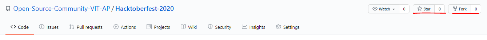
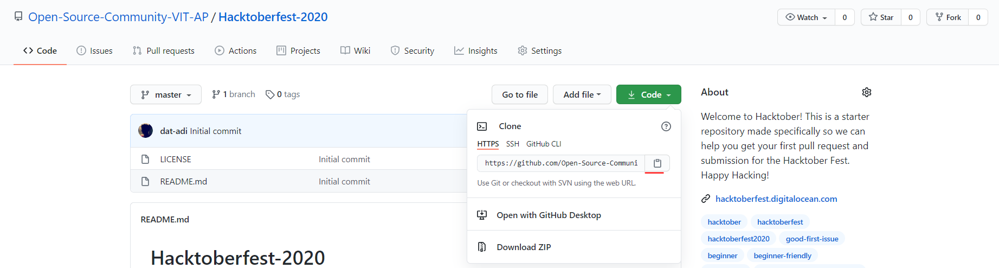
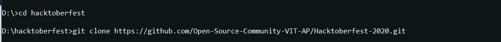
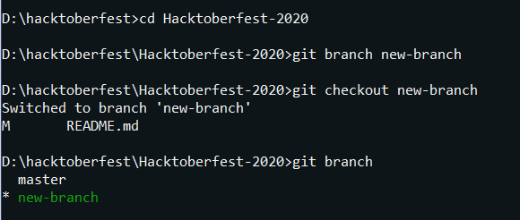
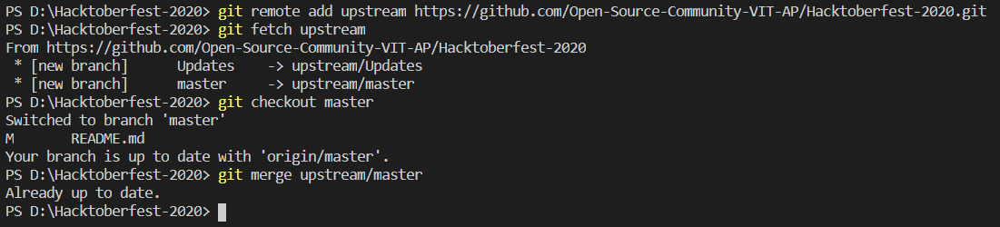

# Contributing to the Repository
## Submission for Hacktoberfest 2023

### 1. Star and Fork this Repository
You can star and fork this repository on GitHub at the top of the repository.

<p align="center">
    
</p>

Forking allows you to create a version of the repository for yourself.\
This allows you to make changes to the repository without requiring any permissions or interfering with the existing repository.\
Now, redirect yourself to your fork of the repository, which should have a URL like so,
> https://github.com/your-github-username/OpenSource101

### 2. Clone the repository to your local computer
To make your own copy of the repository that you would want to contribute to, you'll need to clone it to your system for easier access.
Using the `git clone` commmand, you could clone the repository to your local system.
While the URL would essentially be like,
> https://github.com/your-username/OpenSource101.git

It's easier to just click on the clone icon and copy it to your clipboard.

<p align="center">
    
</p>

After which, just direct yourself to whichever place you wish to clone the repository to using the change directory or `cd` command in terminal and then `git clone` your project.

<p align="center">
    
</p>

### 3. Create a New Branch

Direct yourself into the repository using `cd OpenSource101/`.
Now, we'll create and switch onto the branch that we will be working on, for editing file in the project.

Creating a branch,
```git
git branch branch-name
```

Switching from master branch to another branch,
```git
git checkout branch-name
```

Viewing all the available branches for your repository,
```git
git branch -a
```

<p align="center">
    
</p>

### 4. Contribute!

We can finally get to contributing to the repository now!\
Now that you've switched over to another branch, change your directory to contributors using `cd contributors`.

Create a file with your github username with a `.json` extension.\
Example : *dat-adi.json*

The contents of the JSON file in the below format,
```json
{
    "github-username": "YOUR-GITHUB-USERNAME",
    "favourite-game": "YOUR-FAVOURITE-GAME",
    "favourite-language": "YOUR-FAVOURITE-PROGRAMMING-LANGUAGE",
    "favourite-color": "#FFFFFF"
}
```

```
"github-username" should be the same one as the one you're making the pull request from.

"favourite-game" can be any game that you really like.

"favourite-language" has to be your favourite programming language or any programming language that you really want to learn.

"favourite-color" can be any color in hex format (example: #FFF44F). You can pick any color from Google's color picker.
```

### 5. Committing the changes

You can add all the files that you've updated using the command `git add -A`\
Then, you commit to save the files, like how you would at a checkpoint, `git commit -m "added myself"`

Now, you want to push to your fork online, that works with `git push origin branch-name`.

### 6. Updating the local repository

It is important to keep your local repository updated with the project in order to avoid merge conflicts. To do this, you'll have to configure a remote for the fork and then sync the fork.

#### Configuring a Remote for the fork

In order to create a remote for the fork, you'll need to specify a new remote upstream repoistory (the repository you forked from) to sync with the fork. You'll be using the `git remote add` command to do that.

<pre>git remote add upstream https://github.com/Open-Source-Community-VIT-AP/OpenSource101.git</pre>

**Note**: We have referenced the original repository as "upstream".

#### Syncing the fork

Once the remote references to the original repository you forked from, you are ready to sync changes in order to keep your local copy up to date. To do this, we use the `git fetch` command.

<pre>git fetch upstream</pre>

Once done, you need to switch back to the master branch, you can do this using

<pre>git checkout master</pre>

Now, merge changes made from the original repository's master branch with your current local master branch using

<pre>git merge upstream/master</pre>

<p align="center">
    
</p>

### 7. Making the pull request

Once your local repository is updated, you are all set to send us a pull request.

To do that, just open your forked repository and click on pull request, now you can see a green button that says "New pull request".

Create the pull request and lay back and relax until you receive a notice signifying the acceptance of your pull request or, the request to modify your changes.

## Bugs/Features for the Repository
If you've noticed that there was some kind of error in the code, or if you thought that some of the things in the instructions could be improved or refactored, feel free to open up an issue,
to discuss about the issue on a more detailed level, and if we give you the clear for making changes,

- Create a fork of the repository.
- Work on the proposed changes.
- Send in a pull request for review.
- If all's well and good, we'll merge it. If not, we'll ask you to make a few changes.
- Pat yourself on the back, you've done a good job!

Don't be striken down if your idea wasn't taken into account, or if we said that it felt like it wasn't feasible.\
There are a multitude of bugs, and there's no code that cannot be worked on to provide extra features.\
We are welcome to feedback and changes, and as such, we'd love to hear more of your ideas, maybe the first one didn't work out well, but the next one is always an option!

Also, if worst comes to worst, you could fork the repository and work on your own changes and deliver it to the community.\
Happy Hacking!
