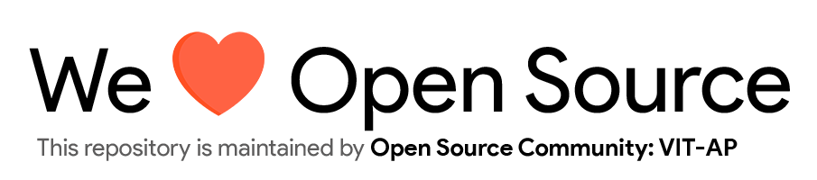

# Welcome to Hacktoberfest! 

<p align="center">
    
</p>

This is a starter repository made specifically so we can help you get your first pull request and submission for the [Hacktoberfest](https://hacktoberfest.digitalocean.com) .\
Happy Hacking!

If you're a beginner and you've come looking for your first contribution, we are here to help.\
We've provided the instructions for you to get started with contributing to Open Source. Scroll down for more info.

## To get started with Hacktoberfest
### 1. Register yourself for Hacktober Fest 2020

<p align="center">
    
</p>

Register for the event by pressing on the blue `Start Hacking` button.\
It should redirect you to the [login page](https://hacktoberfest.digitalocean.com/login) where you can link your GitHub page in order to track your progress with the pull requests for the event.

### 2. Tracking your progress

<p align="center">
    
</p>

Now, you should be able to see the progress you've made for Hacktober's pull request checks.\
If you can make 4 valid pull requests, you can receive a limited edition T-shirt, or you can plant a tree!

### 3. Now what?

Now, you can start contributing to Open Source and with each successful pull request, you can be a part of Hacktoberfest within no time!\
Hacktoberfest is a gathering of coders and geeks from all over the world, collaborating and learning from one another.\
Open sourcing and contributing to the free internet is what drives the internet today, and everyone and every single contribution is appreciated in the Open Source world.\
And, you can join us with your first pull request right here!

## First pull request to Glory
### 1. Star and Fork this Repository
You can star and fork this repository on GitHub at the top of the repository.

<p align="center">
    
</p>

Forking allows you to create a version of the repository for yourself.\
This allows you to make changes to the repository without requiring any permissions or interfering with the existing repository.\
Now, redirect yourself to your fork of the repository, which should have a URL like so,
> https://github.com/your-github-username/Hacktoberfest-2020

### 2. Clone the repository to your local computer
To make your own copy of the repository that you would want to contribute to, you'll need to clone it to your system for easier access.
Using the `git clone` commmand, you could clone the repository to your local system.
While the URL would essentially be like,
> https://github.com/your-username/Hacktoberfest-2020.git

It's easier to just click on the clone icon and copy it to your clipboard.

<p align="center">
    
</p>

After which, just direct yourself to whichever place you wish to clone the repository to using the change directory or `cd` command in terminal and then `git clone` your project.

<p align="center">
    
</p>

### 3. Create a New Branch

Direct yourself into the repository using `cd Hackoctoberfest-2020`.
Now, we'll create and switch onto the branch that we will be working on, for editing file in the project.

Creating a branch,
```git
git branch branch-name
```

Switching from master branch to another branch,
```git
git checkout branch-name
```

Viewing all the available branches for your repository,
```git
git branch
```

<p align="center">
    
</p>

### 4. Contribute!

We can finally get to contributing to the repository now!\
Now that you've switched over to another branch, change directory into contributors.

Create a file with your github username with a `.json` extension.\
Example : *dat-adi.json*

The contents of the JSON file in the below format,
```json
{
    "github-username": "YOUR-GITHUB-USERNAME",
    "favourite-game": "YOUR-FAVOURITE-GAME",
    "favourite-language": "YOUR-FAVOURITE-PROGRAMMING-LANGUAGE",
    "favourite-color": "#FFFFFF"
}
```

```
"github-username" should be the same one as the one you're making the pull request from.

"favourite-game" can be any game that you really like.

"favourite-language" has to be your favourite programming language or any programming language that you really want to learn.

"favourite-color" can be any color in hex format (example: #FFF44F). You can pick any color from Google's color picker.
```

### Want to add something more?

If you want to add something more, maybe a project, or a program, or just a photograph you took, Maybe even showcase your website. 

You can. You can even add resources or YouTube links to videos you found useful for programming.

Just create a **.json** file inside the "content-sharing" folder and add links to anything you want to share. 
example :

```json
{
    "Resources" : ["https://www.youtube.com/user/thenewboston","https://docs.github.com/"],
    "Projects" : ["https://github.com/torvalds/linux"],
    "Images" : ["https://tinyurl.com/y45lx6oc"],
    "Websites" : ["https://www.google.com/"]
}
```

**Note** : Make sure your contributions are in line with our [Code of Conduct](https://github.com/Open-Source-Community-VIT-AP/Hacktoberfest-2020/blob/master/.github/CODE_OF_CONDUCT.md).

### 5. Committing the changes

You can add all the files that you've updated using the command `git add -A`\
Then, you commit to save the files, like how you would at a checkpoint, `git commit -m "added myself"`

Now, you want to push to your fork online, that works with `git push origin branch-name`.

### 6. Updating the local repository

It is important to keep your local repository updated with the project in order to avoid merge conflicts. To do this, you'll have to configure a remote for the fork and then sync the fork.

#### Configuring a Remote for the fork

In order to create a remote for the fork, you'll need to specify a new remote upstream repoistory (the repository you forked from) to sync with the fork. You'll be using the `git remote add` command to do that.

<pre>git remote add upstream https://github.com/Open-Source-Community-VIT-AP/Hacktoberfest-2020.git</pre>

**Note**: We have referenced the original repository as "upstream".

#### Syncing the fork

Once the remote references to the original repository you forked from, you are ready to sync changes in order to keep your local copy up to date. To do this, we use the `git fetch` command.

<pre>git fetch upstream</pre>

Once done, you need to switch back to the master branch, you can do this using

<pre>git checkout master</pre>

Now, merge changes made from the original repository's master branch with your current local master branch using

<pre>git merge upstream/master</pre>

<p align="center">
    
</p>

### 7. Making the pull request

Once your local repository is updated, you are all set to send us a pull request.

To do that, just open your forked repository and click on pull request, now you can see a green button that says "New pull request".

Create the pull request and lay back and relax until you receive a notice signifying the acceptance of your pull request or, the request to modify your changes.

**Note** : If you have any question regarding any of the steps above or about anything related to this repository, just create an issue.

## Open Source and it's wonders

Now, that you've made your first pull request, it's time to explore the vast Open Source network, filled with projects that have ground-breaking potential.\
Projects that can revolutionalize the way we look at things.\
As well as create your own for other people to appreciate and contribute to!

# *Get, Set, Hack!*

<p align="center">
    
</p>
